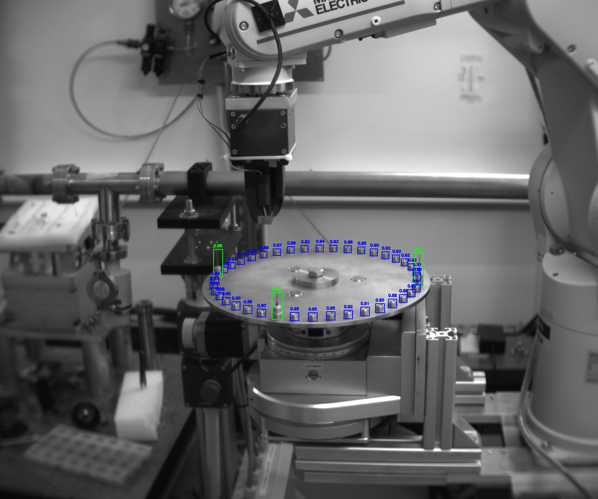
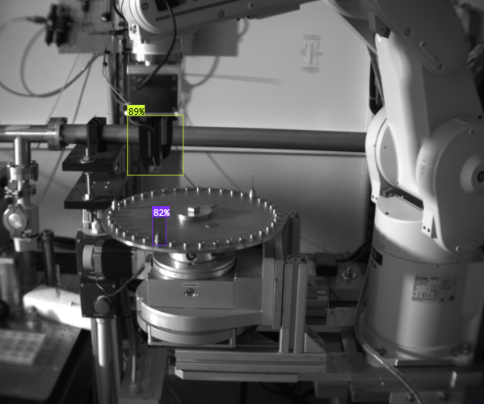

# Sample Container Parser

This code uses AI and Image processing to detect all samples and sample holders in the sample container, including hidden sample holders by other samples

# Pickup Position Parser

* Objective: To detect and validate the pickup position using the fingers as reference points.

  - Model Used: YOLOv8s (Small variant of YOLOv8)
  - Training Environment:
    1. Device: Office PC
    2. Training Duration: ~6 hours
    4. Epochs: 250
    5. Dataset Size: 190 agumented annotated images (generated using Roboflow) with the following parameters: ()
       a. Grayscale: Applied to 20% of images
       b. Brightness Adjustment: Between -24% and +24%
       c. Blur: Up to 1 pixel Gaussian blur
       d. Noise: Added to up to 1.72% of image pixels

    6. Confidence Threshold: Predictions were considered valid if the confidence was ≥ 78%.

